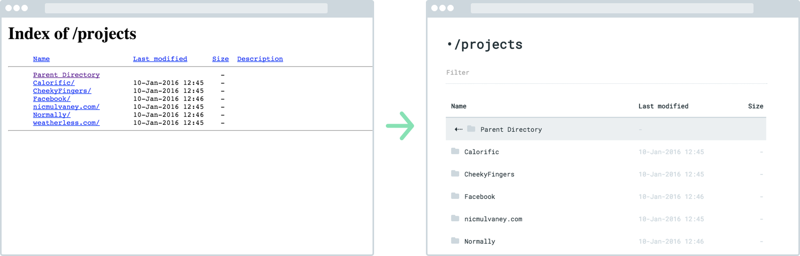

# doxy
*Modern, mobile friendly web directories.*




## Installation
1. Copy *[doxy.html](https://raw.githubusercontent.com/mulhoon/doxy/master/dist/doxy.html)* to your server
2. Add this to the end of your root *.htaccess*

```
IndexOptions FancyIndexing IgnoreCase FoldersFirst SuppressHTMLPreamble SuppressIcon
HeaderName /doxy.html
```

Make your own theme [here](ADVANCED.md)
